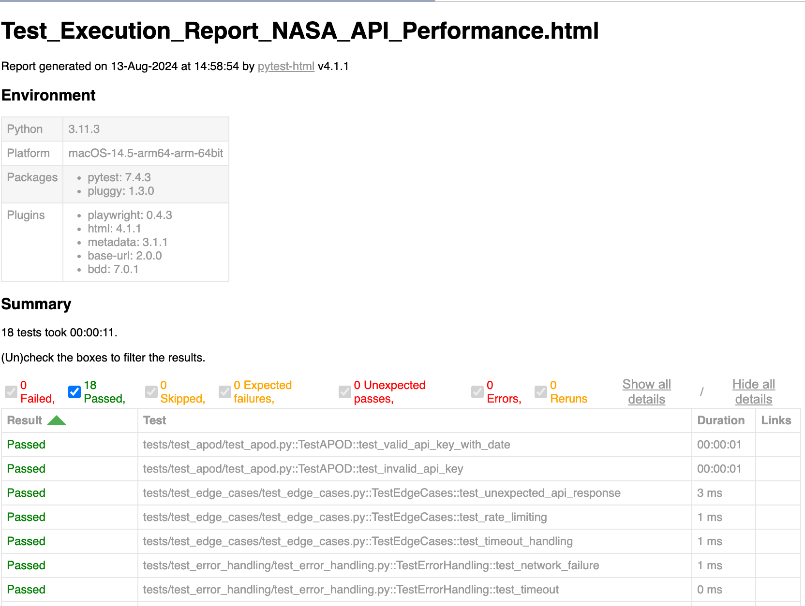

# NASA API Project

This project demonstrates the use of Python to interact with NASA APIs, showcasing skills in Python,
pytest, and the 'requests' library. The project is organized to demostrate best practices in project
structure, API interaction, and testing strategies, focusing on GET requests due to the nature of the NASA APIs.

## Project Overview

This project leverages the following NASA APIs:
- **Astronomy Picture of the Day (APOD)**: Retrieves imagery and associated data from NASA's APOD service.
- **Near Earth Object Web Service (NeoWs)**: Provides information on near-Earth objects, allowing users to search for asteroids
based on their closest approach to Earth, lookup specific asteroids by their NASA JPL small body ID, and browse the overall dataset.

### Key files

- **config/settings.py**: Manages configuration settings, including API keys and base URLs.
- **utils/helper.py**: Contains utility functions to interact with the NASA APIs, such as `get_neo_feed`, `get_neo_lookup`, and `get_apod`.
- **tests/**: Contains all test cases structured by category, including edge cases, error handling, performance, and specific API tests.

## Setting Up the Project

### Prerequisites
- Python 3.11+
- `pip` (Python package installer)

### Installation

1. Clone the repository:
```bash
   git clone <repository-url>
   cd nasa_api_project
```

2. Create a virtual environment:
```bash
   python3 -m venv venv
   source venv/bin/activate
```

3. Install the required packages:
```bash
   pip install -r requirements.txt
```
4. Set up your .env file with yoyr NASA API key:
```env
   NASA_API_KEY=your_nasa_api_key
```

### Running the tests
```bash
   pytest -vs /tests
```

After the tests are executed, a HTML report will be generated in the results/ directory using the pytest-html library.



### Test Categories
- **APOD Tests (tests/test_apod/test_apod.py)**: Validates the correct retriveal of data from the APOD API.
- **NeoWs Tests (tests/test_neo_ws)**: Tests for the NeoWs API, including feed retrieval and specific asteroid lookup.
- **Edge Case Tests (tests/test_edge_cases/test_edge_cases.py)**: Tests how the application handles unexpected API responses, such as unexpected keys in the response or rate-limiting errors.
- **Error Handling Tests (tests/test_error_handling/test_error_handling.py)**: Simulates network failures, API timeouts, and missing API keys to ensure robust error handling.
- **Performance Tests (tests/test_performance/test_performance.py)**: Measures the performance of API interactions by recording response times and validating that they meet acceptable thresholds.

### NASA APIs Used

#### Astronomy Picture of the Day (APOD)

The APOD API allows you to retrieve NASA's Astronomoy Picture of the Day and its associated metadata.

- **Endpoint**: https://api.nasa.gov/planetary/apod
- **Example Query**:
```bash
   https://api.nasa.gov/planetary/apod?date=2023-07-22&api_key=DEMO_KEY
```

#### NeoWS (Near Earth Object Web Service)

NeoWs is used for retrieving information on near-Earth objects.

- **Feed Endpoint**: Retrieves a list of asteroids based on their closest approach date to Earth.
```bash
   https://api.nasa.gov/neo/rest/v1/feed?start_date=2023-07-01&end_date=2023-07-07&api_key=DEMO_KEY
```

- **Lookup Endpoint**: Looks up a specific asteroid using its NASA JPL small body ID.
```bash
https://api.nasa.gov/neo/rest/v1/neo/3542519?api_key=DEMO_KEY
```